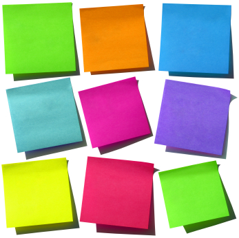
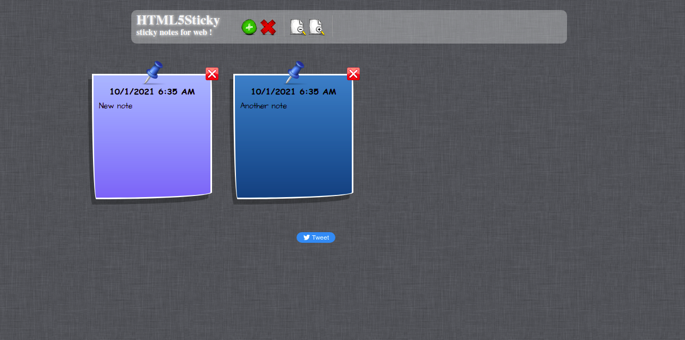

<p align="center">
 
</p>

<h1 align="center">StickyNotes</h1>

<div align="center">

[](https://github.com/roy15simrn/StickyNotes/blob/master/LICENSE.md) [](https://github.com/roy15simrn/StickyNotes)

[](https://github.com/roy15simrn/StickyNotes/issues) [](https://github.com/roy15simrn/StickyNotes/issues?q=is%3Aissue+is%3Aclosed) [](https://github.com/roy15simrn/StickyNotes/pulls) [](https://github.com/roy15simrn/StickyNotes/pulls?q=is%3Apr+is%3Aclosed)

[](https://github.com/roy15simrn/StickyNotes/graphs/contributors) [](https://github.com/roy15simrn/StickyNotes/graphs/commit-activity)

</div>

---

## 🏁 Getting Started

- clone project

  ```
  git clone https://github.com/roy15simrn/StickyNotes
  ```

  ```
  cd StickyNotes/
  ```

- Open `index.html` in browser

## 🧐 Preview

<p align="center">
 
</p>

## 🤖 Features

- Add note
- Delete note
- Delete all notes
- Expand and collapse notes
- Add notes to localstorage
